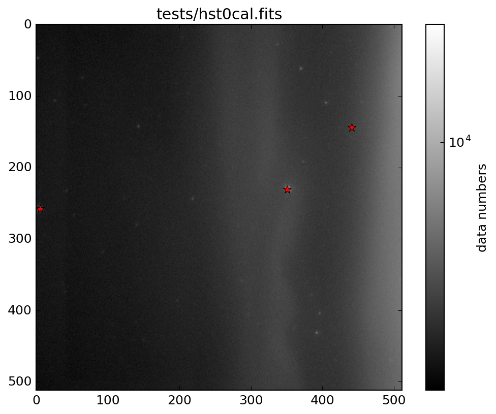
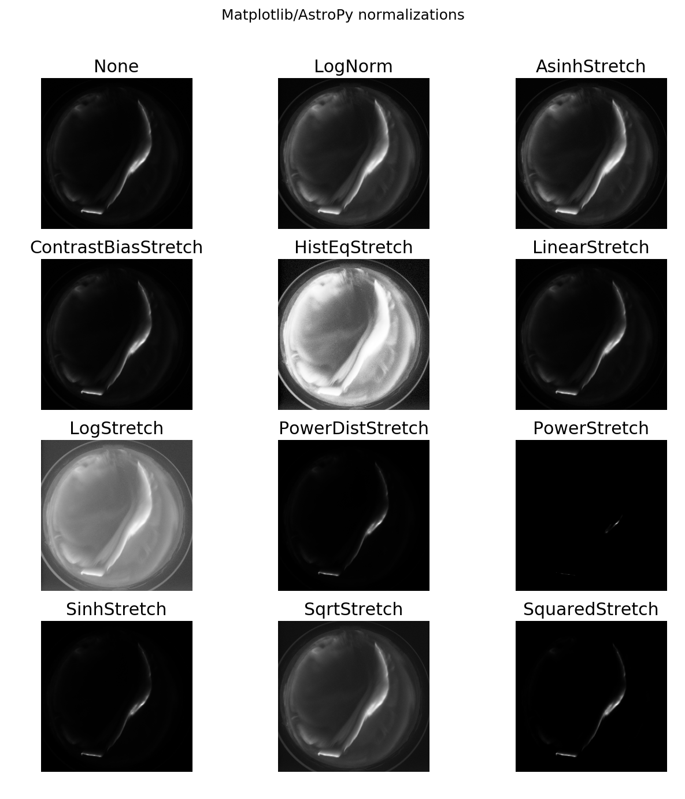

# Star Scalar (Photometry and Astrometry)

Uses AstroPy to do some of the intermediate steps of source extraction
and photometry that one might do in a more refined and accurate fashion
with [Source Extractor](http://www.astromatic.net/software/sextractor)
and [SCAMP](http://www.astromatic.net/software/scamp) or
[Astrometry.net](http://astrometry.net).

I want to find stars with 5-50 degree FOV cameras, so I do not think
about galaxy extents in an image, since when a galaxy is in view, it\'s
pretty small.

## Local maxima finder



useful for radar, blood cells, stars, etc.:

    python localmax2d.py test/hst0cal.fits

## AstroPy Constrast Stretching Plots



AstroPy builds in several types of contrast stretching used with
Matplotlib besides the usual Linear or Log normalization:

```sh
python PlotContrastStretch.py tests/PKR_DASC_0558_20151007_060527.611.FITS
```
